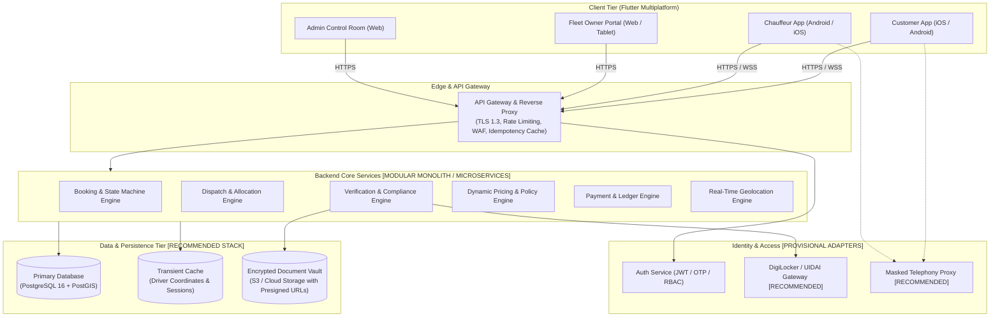

# ShadiDriver - System Architecture & Flutter Technical Design

**Document Version:** 1.1.0  
**Status:** REFINED ARCHITECTURAL SPECIFICATION  
**Author:** Lead Software Architect  
**Target Platform:** Flutter (iOS, Android, Web) | Scalable Backend Cloud  

---

## 1. Architectural Decision Classification

To ensure clear governance between foundational software engineering principles and provisional infrastructure choices, all architectural decisions in ShadiDriver are classified into four explicit categories:

```
┌──────────────────────────────────────────────────────────────────────────────────────────┐
│                               DECISION CLASSIFICATION FRAMEWORK                          │
├──────────────────────────────────────────────────────────────────────────────────────────┤
│ 1. CONFIRMED ARCHITECTURAL PRINCIPLES                                                   │
│    Immutable engineering standards. Application codebase is built strictly upon these.    │
│    • Feature-First Clean Architecture (Presentation, Domain, Data, Core, Services)        │
│    • Inward Dependency Rule: Pure Dart domain layer with zero Flutter UI/network imports │
│    • Riverpod 2.x (Notifier / AsyncNotifier) for predictable, declarative state           │
│    • GoRouter for declarative routing, deep-linking, and role-based redirect guards       │
│    • Freezed & json_serializable for immutable value objects and union types              │
│    • Dio client abstraction with interceptors (auth token refresh, correlation IDs)      │
│    • Abstract Repository Pattern separating domain ports from data adapters               │
│    • Server-Authoritative Booking State Machine (Clients are read-only requestors)       │
│    • Configurable Business Rules (No hard-coded prices, percentages, or grace windows)   │
│    • Strong Security & Testing Boundaries (>90% domain coverage target, RBAC, KMS)       │
├──────────────────────────────────────────────────────────────────────────────────────────┤
│ 2. RECOMMENDED BUT NOT YET FINAL                                                         │
│    Architecturally preferred for MVP velocity, but abstracted behind domain interfaces.  │
│    • Backend Engine: Supabase (PostgreSQL + PostGIS + RLS) vs Custom Backend              │
│    • Primary Region: AWS Mumbai (`ap-south-1`) / GCP Mumbai (`asia-south1`)              │
│    • Primary Key Standard: UUIDv7 (time-ordered) vs UUIDv4                               │
│    • Object Storage: AWS S3 / Cloud Storage with 15-minute presigned URLs                │
│    • Payment Aggregator: Razorpay / Cashfree (RBI compliant, UPI AutoPay support)        │
│    • Masked Telephony: Exotel / Twilio Virtual Number Proxy                              │
│    • Identity Verification: DigiLocker API / UIDAI Masking Gateway                       │
├──────────────────────────────────────────────────────────────────────────────────────────┤
│ 3. BUSINESS DECISION REQUIRED                                                            │
│    Commercial and operational policies requiring executive confirmation.                 │
│    • Advance token percentage (e.g., 20% vs 50% vs 100% upfront escrow)                  │
│    • Cancellation penalty schedule & customer refund tiers                               │
│    • Baraat firecracker / smoke damage liability & security deposit requirements         │
│    • Chauffeur ceremonial uniform procurement model (capex/deposit vs driver-owned)      │
│    • Platform commission take-rate across independent drivers vs fleet operators         │
├──────────────────────────────────────────────────────────────────────────────────────────┤
│ 4. FUTURE / OPTIONAL                                                                     │
│    Post-MVP optimizations to be introduced as scale demands.                            │
│    • Transition from Modular Monolith to independent Go/Node microservices              │
│    • Dedicated React/Next.js Admin Console if Flutter Web does not meet power-user UX   │
│    • Biometric app lock (FaceID / Fingerprint) for driver pre-trip attestation           │
│    • Automated multi-vehicle convoy dispatch algorithms for large guest movements        │
└──────────────────────────────────────────────────────────────────────────────────────────┘
```

---

## 2. Comprehensive Backend Evaluation for MVP

The core architectural dilemma for ShadiDriver's MVP is selecting a backend that maximizes time-to-market for the upcoming Indian wedding season without incurring fatal technical debt or violating Indian regulatory statutes.

### 2.1 Comparative Matrix

| Evaluation Dimension | Firebase (Firestore + Cloud Functions) | Supabase (Managed PostgreSQL + PostGIS) | Custom Backend (Go / Node.js + PostgreSQL) |
| :--- | :--- | :--- | :--- |
| **Relational Integrity & Schema Rigor** | **POOR**: NoSQL document store. Cross-referencing users, vehicles, chauffeurs, multi-day bookings, and ledger entries requires denormalization or brittle client fan-outs. | **SUPERIOR**: Native PostgreSQL 16. Full foreign keys, `CHECK` constraints, composite unique keys, and strict relational integrity. | **SUPERIOR**: Native PostgreSQL with complete ORM/migration control (Prisma, SQLx, or GORM). |
| **ACID Transactions for Bookings** | **MEDIOCRE**: Firestore transactions have a 500-document limit and fail under contention. Difficult to enforce complex multi-table locks across driver calendars and escrow. | **EXCELLENT**: True serializable and read-committed ACID transactions with `SELECT FOR UPDATE` row locks to prevent double-booking. | **EXCELLENT**: Full programmatic control over transaction boundaries, isolation levels, and retry loops. |
| **Geospatial Queries (PostGIS)** | **POOR**: GeoFirestore relies on geohashing bounding boxes. Cannot compute road distances, polygon geofencing for banquet resorts, or nearest-neighbor searches natively. | **SUPERIOR**: Native **PostGIS** extension (`ST_DWithin`, `ST_Point`, spatial `GIST` indexes) for instant chauffeur proximity queries. | **SUPERIOR**: Native PostGIS integration with custom spatial indexing and routing integration. |
| **Server-Authoritative State Machine** | **MEDIOCRE**: Business logic distributed across Cloud Functions and Firestore Security Rules. Difficult to test state transitions locally. | **STRONG**: Encapsulated in PostgreSQL Stored Procedures, Triggers, and Supabase Edge Functions with full transactional safety. | **SUPERIOR**: Domain-Driven Design (DDD) state machine executed in compiled code with unit-tested transition tables. |
| **Data Sovereignty & DPDP Act 2023** | **ACCEPTABLE**: Google Cloud Mumbai (`asia-south1`) available, but granular field-level masking in security rules is tedious and error-prone. | **EXCELLENT**: AWS Mumbai (`ap-south-1`) hosted. Row-Level Security (RLS) provides mathematically proven tenant isolation per role. | **HIGHEST**: Complete control over data residency, memory wiping, and custom field-level AES-256 encryption before persistence. |
| **Developer Velocity for MVP** | **HIGH for toy apps, LOW for complex domains**: Rapid auth setup, but weeks lost writing custom aggregations and consistency reconcilers. | **VERY HIGH**: Instant REST & Realtime APIs generated from SQL schema, built-in Auth, instant PostGIS, and interactive dashboard. | **MODERATE**: Requires 6–8 weeks of upfront engineering for Auth, API routing, migrations, containerization, and CI/CD. |
| **Vendor Lock-in & Portability** | **SEVERE**: Proprietary NoSQL query model and Cloud Functions APIs. Migration requires total backend rewrite. | **MINIMAL**: 100% open-source PostgreSQL. If Supabase is ever abandoned, data dumps restore cleanly onto standard RDS, Cloud SQL, or bare metal. | **ZERO**: Complete ownership of all application code and infrastructure. |
| **Operational Cost at Scale** | Unpredictable document read/write spikes during high-traffic wedding muhurat dates. | Predictable compute/RAM tiers; open-source self-hosting option available. | Standard container/VM compute pricing. |

### 2.2 Architectural Recommendation & Decision Rationale
* **Recommendation**: **Supabase (PostgreSQL 16 + PostGIS) on AWS Mumbai (`ap-south-1`)** is selected as the **`RECOMMENDED BUT NOT YET FINAL`** engine for the MVP.
* **Why Supabase Wins**:
  1. Wedding mobility is inherently relational and transactional: bookings depend on verified vehicles, which depend on verified drivers, which depend on availability time-slots, which depend on payment tokens. Firestore is fundamentally the wrong data model for this domain.
  2. PostGIS solves chauffeur dispatch proximity natively without third-party spatial indexing add-ons.
  3. Row-Level Security (RLS) guarantees that drivers, customers, and fleet owners can never query each other's records even if a client bug occurs.
  4. Most critically: **Zero Vendor Lock-in**. Because Supabase is pure PostgreSQL, our Flutter client's repository abstraction allows migrating to a custom Go/Node backend in Phase 3 without altering a single screen or domain entity.

---

## 3. Authoritative Responsibilities & Boundaries

```
┌────────────────────────────────────────────────────────────────────────────────────────┐
│                              SYSTEM RESPONSIBILITY MATRIX                              │
├──────────────────────────────────────────┬─────────────────────────────────────────────┤
│ AUTHORITATIVE BACKEND RESPONSIBILITIES   │ FLUTTER CLIENT RESPONSIBILITIES             │
├──────────────────────────────────────────┼─────────────────────────────────────────────┤
│ 1. Booking State Machine Evaluation     │ 1. Rendering UI & State Stepper             │
│ 2. Dynamic Pricing & Tax Calculation     │ 2. Capturing & Formatting User Input        │
│ 3. Calendar Slot Locking & De-duplication│ 3. Local Input Validation & UX Feedback     │
│ 4. Payment Verification & Webhook Auth   │ 4. Hardware Keystore Session Management     │
│ 5. Verification Status & KYC Decisions   │ 5. GPS Telemetry Capture & Smoothing        │
│ 6. RBAC Permission Enforcement           │ 6. Offline Action Queuing (Driver App)      │
│ 7. Audit Logging & Compliance Ledger     │ 7. WebSocket Stream Consumption & Map Poly  │
│ 8. Virtual Telephony Number Bridging     │ 8. Local Notification Display               │
└──────────────────────────────────────────┴─────────────────────────────────────────────┘
```

### 3.1 Data That Must NEVER Be Trusted from the Client
The backend API Gateway and application controllers must treat the following incoming client values as untrusted and re-evaluate them server-side:

1. **Monetary Amounts & Pricing**: Client requests never supply `total_amount`, `discount_cents`, `tax_cents`, or `token_cents`. The client only passes `service_category_id`, `vehicle_class`, `event_start_time`, `event_end_time`, and selected addon IDs. The backend pricing engine is the sole source of truth for pricing.
2. **Booking Lifecycle State**: The client can never submit `status = "CONFIRMED"` or `status = "COMPLETED"`. The client submits an `action` (e.g. `START_TRIP`), and the backend verifies all invariants before transitioning state.
3. **User Role & Claims**: Client-supplied headers or JSON bodies claiming `role = "SUPER_ADMIN"` or `is_verified = true` are discarded. Roles are determined exclusively from cryptographically signed JWT claims verified by the server.
4. **Verification & KYC Approvals**: Document validity, expiration dates, and approval flags are strictly immutable to driver and customer clients.
5. **Driver Location Timestamps**: Telemetry timestamps submitted by mobile devices must be validated against server clock boundaries (rejecting drift > 5 minutes) to prevent replay or spoofing attacks.

### 3.2 Action Classifications

#### Audit-Sensitive Actions (Mandatory Immutable Audit Log)
* Role elevation or user permission modification.
* Verification document review (Approved, Rejected, Action Required) with admin ID and reason.
* Manual dispatch override or emergency driver reassignment by operations staff.
* Manual fare override, penalty waiver, or dispute refund execution.
* Chauffeur account suspension or vehicle blacklisting.
* PII export or full account erasure under DPDP Act.

#### Idempotent Operations (Must Provide `Idempotency-Key` Header)
* `POST /api/v1/bookings` (Booking request creation - prevents duplicate reservations if user double-taps).
* `POST /api/v1/bookings/{id}/transition` (State transitions - replaying an already completed transition returns identical status).
* `POST /api/v1/payments/create-order` (Payment order generation).
* `POST /api/v1/drivers/documents` (Document upload metadata submission).
* `POST /api/v1/payouts/request` (Disbursement request execution).

#### Concurrency-Sensitive Operations (Requires Optimistic Locking / DB Row Locks)
* Chauffeur accepting a booking offer (`REQUESTED` -> `DRIVER_ACCEPTED`): Multiple drivers cannot accept the same wedding slot.
* Vehicle allocation to a booking: Prevents double-booking a luxury sedan across overlapping timeframes.
* State transitions on active bookings (`current_version` check prevents conflicting updates from customer, driver, and operations admin).
* Advance token escrow capture and release: Prevents double-charging or race conditions in payout disbursements.

---

## 4. High-Level System Topology



---

## 5. Flutter Production Architecture: Feature-First Clean Architecture

The Flutter client enforces strict **Feature-First Clean Architecture** with the **Inward Dependency Rule**: inner layers know nothing of outer layers.

```
       ┌────────────────────────────────────────────────────────┐
       │                   Presentation Layer                   │
       │     (Widgets, Screens, Riverpod State Controllers)     │
       └───────────────────────────┬────────────────────────────┘
                                   │ depends on
                                   ▼
       ┌────────────────────────────────────────────────────────┐
       │                      Domain Layer                      │
       │    (Entities, Value Objects, Failures, Repositories)   │
       │            ★ PURE DART - ZERO FLUTTER UI ★             │
       └───────────────────────────▲────────────────────────────┘
                                   │ implements
                                   │ interface
       ┌───────────────────────────┴────────────────────────────┐
       │                       Data Layer                       │
       │       (DTOs, Mappers, Repositories, DataSources)       │
       └────────────────────────────────────────────────────────┘
```

### 5.1 Layer Responsibilities & Isolation Invariants
* **`domain`**: Pure Dart only (`no package:flutter/material.dart`). Contains business entities (`Booking`, `Driver`, `Vehicle`), value objects (`PhoneNumber`, `Money`), typed failure definitions (`AppFailure`), and abstract repository interfaces (`BookingRepository`).
* **`data`**: Implements domain interfaces. Handles DTO parsing (`freezed`), API communication via `Dio`, local caching, and mapping between DTOs and Domain entities.
* **`presentation`**: UI widgets and Riverpod controllers (`Notifier` / `AsyncNotifier`). Watches domain state; never executes direct network or database queries.
* **`core`**: Design system tokens, typography, constants, network interceptors, and route configurations.
* **`services`**: Hardware and OS abstractions (`LocationService`, `PushNotificationService`, `SecureStorageService`).

---

## 6. Recommended Folder & Module Structure

```
lib/
├── app.dart                           # Root MaterialApp.router setup
├── bootstrap.dart                     # Zone error handling, DI initialization
├── main_customer.dart                 # Customer App entry point
├── main_driver.dart                   # Chauffeur App entry point
├── main_admin.dart                    # Admin Dashboard entry point
│
├── core/                              # Cross-cutting foundational modules
│   ├── config/                        # Environment configs (dev, staging, prod)
│   ├── constants/                     # App-wide constants (keys, assets, regex)
│   ├── errors/                        # Typed failures (AppFailure, ServerFailure)
│   ├── network/                       # Dio client, Auth/Error/Logging interceptors
│   ├── router/                        # GoRouter configuration, route guards
│   ├── theme/                         # ShadiDriver Design System (Burgundy & Gold)
│   └── utils/                         # Currency formatters (INR Paise), date formatters
│
├── services/                          # Device & Hardware Adapters
│   ├── location/                      # Geolocation & background tracking
│   ├── notifications/                 # Push notifications & local alerts
│   ├── storage/                       # Encrypted key-value storage (Keystore/Keychain)
│   └── telephony/                     # Call masking & in-app communication
│
└── features/                          # Feature-First Vertical Slices
    ├── auth/                          # Phone OTP Auth & Session Management
    ├── verification/                  # Chauffeur KYC & Document Verification
    ├── catalog/                       # Ceremony Categories, Vehicles & Addons
    ├── booking/                       # Booking Engine, Customizer & State Machine
    ├── tracking/                      # Real-time Chauffeur Telemetry & Maps
    ├── payments/                      # Advance Tokens, Escrow & Invoices
    └── admin_control_room/            # Operations & Verification Queue (Admin)
```

---

## 7. Design System & Theming Tokens

### 7.1 Palette Specification
* **Primary Burgundy**: `#58111A` (Deep Royal Burgundy - ceremonial elegance)
* **Dark Burgundy**: `#3B0910` (Background / Top AppBars / Headers)
* **Champagne Gold**: `#D4AF37` (Primary accent, highlights, CTA accents)
* **Warm Gold**: `#C59B27` (Pressed states, badges, borders)
* **Soft Champagne**: `#F5E6BE` (Subtle highlight surfaces, chips, divider fills)
* **Ivory**: `#FDFBF7` (Primary scaffold background, card fills)
* **Secondary Surface**: `#F5F2FB` (Subtle tinted surfaces for contrast)
* **Verified Emerald**: `#1E7E34` (Strictly reserved for verified badges, safety indicators)
* **Urgent Saffron**: `#E65100` (Used for emergency dispatches, timer count-downs, alerts)

### 7.2 Typography Pairing
* **Display / Ceremonial Headings**: `Playfair Display` (Font weights: SemiBold 600, Bold 700) - used exclusively for ceremony headers, welcome banners, and milestone cards.
* **UI / Body / Numerical Data**: `Plus Jakarta Sans` (Font weights: Regular 400, Medium 500, SemiBold 600) - used for all functional controls, navigation, forms, and monetary figures.
