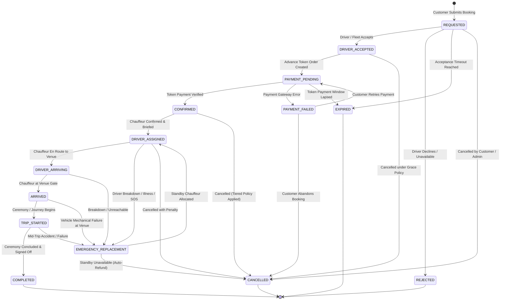

# ShadiDriver - Booking Lifecycle State Machine Specification

**Document Version:** 1.1.0  
**Status:** REFINED STATE MACHINE SPECIFICATION  
**Author:** Lead Software Architect  
**Authority:** Server Authoritative / Client Read-Only  

---

## 1. High-Level Lifecycle State Machine Diagram



---

## 2. Rigorous State Transition Table

Every state transition in ShadiDriver is governed by the following 7-attribute contract:

| Transition (`From` -> `To`) | Actor(s) | Preconditions | Rejection Reason | Audit Event Emitted | Concurrency Requirement | Payment Implication |
| :--- | :--- | :--- | :--- | :--- | :--- | :--- |
| `[*] -> REQUESTED` | `CUSTOMER` | Future event date; valid category & city; verified phone. | `INVALID_BOOKING_DRAFT` | `BOOKING_SUBMITTED` | Row creation in serializable transaction. | Computes required advance token amount (no charge yet). |
| `REQUESTED -> DRIVER_ACCEPTED` | `DRIVER`, `FLEET_OWNER` | Driver is `APPROVED`; no overlapping slot in `availabilities`. | `DRIVER_UNAVAILABLE_OR_OVERLAPPING` | `DRIVER_ACCEPTED_OFFER` | Optimistic lock (`version` check); availability row lock (`SELECT FOR UPDATE`). | None (token payment triggered next). |
| `REQUESTED -> REJECTED` | `DRIVER`, `FLEET_OWNER` | Driver actively declines incoming offer. | `OFFER_ALREADY_RESOLVED` | `DRIVER_REJECTED_OFFER` | Optimistic lock (`version` check). | None. |
| `REQUESTED -> EXPIRED` | `SYSTEM` (Cron) | Acceptance timer (e.g., 30 min) elapsed with 0 accepts. | `BOOKING_NOT_IN_REQUESTED_STATE` | `BOOKING_TIMEOUT_EXPIRED` | Optimistic lock (`version` check). | None; releases tentative availability lock. |
| `DRIVER_ACCEPTED -> PAYMENT_PENDING` | `SYSTEM`, `CUSTOMER` | Valid pricing rule; payment order created at gateway. | `PAYMENT_ORDER_CREATION_FAILED` | `PAYMENT_PENDING_ORDER_CREATED` | Optimistic lock (`version` check). | Gateway order generated; starts token payment countdown (15 min). |
| `PAYMENT_PENDING -> CONFIRMED` | `SYSTEM` (Webhook) | Gateway cryptographic signature verified; amount matches token. | `PAYMENT_SIGNATURE_MISMATCH` | `PAYMENT_TOKEN_CAPTURED` | Distributed lock on `gateway_order_id`; optimistic lock on booking. | Advance token captured in escrow; booking reference issued. |
| `PAYMENT_PENDING -> PAYMENT_FAILED` | `SYSTEM` (Webhook) | Gateway decline, 3DS cancellation, or timeout. | `GATEWAY_WEBHOOK_INVALID` | `PAYMENT_TOKEN_FAILED` | Optimistic lock (`version` check). | Zero money captured; customer alerted to retry. |
| `PAYMENT_PENDING -> EXPIRED` | `SYSTEM` (Cron) | Payment window (15 min) lapsed without success. | `PAYMENT_ALREADY_FINALIZED` | `PAYMENT_WINDOW_EXPIRED` | Optimistic lock; releases calendar lock. | Cancels pending gateway order. |
| `PAYMENT_FAILED -> PAYMENT_PENDING` | `CUSTOMER` | Retry payment initiated within grace window. | `RETRY_WINDOW_EXPIRED` | `PAYMENT_RETRY_INITIATED` | Optimistic lock (`version` check). | Issues new gateway checkout session. |
| `CONFIRMED -> DRIVER_ASSIGNED` | `FLEET_OWNER`, `OPERATIONS_ADMIN`, `SYSTEM` | Chauffeur assigned, ceremonial attire verified, briefing sent. | `DRIVER_KYC_SUSPENDED_OR_EXPIRED` | `CHAUFFEUR_ASSIGNED_AND_BRIEFED` | Row-level lock on driver availability. | Locks full calendar slot as `BOOKED`. |
| `DRIVER_ASSIGNED -> DRIVER_ARRIVING` | `DRIVER` | Pre-trip checklist completed, grooming selfie uploaded, GPS active. | `PRE_TRIP_CHECKLIST_INCOMPLETE` | `CHAUFFEUR_DEPARTED_FOR_VENUE` | Optimistic lock (`version` check). | Activates real-time customer tracking and virtual telephony bridge. |
| `DRIVER_ARRIVING -> ARRIVED` | `DRIVER` | Chauffeur GPS inside venue geofence (`radius <= 200m`). | `GEOFENCE_PROXIMITY_FAILED` | `CHAUFFEUR_ARRIVED_AT_VENUE` | Optimistic lock (`version` check). | Alerts wedding family: "Chauffeur on standby at venue gate." |
| `ARRIVED -> TRIP_STARTED` | `DRIVER` | Host family OTP verification or digital ceremony sign-off. | `INVALID_START_OTP` | `CEREMONY_TRIP_STARTED` | Optimistic lock (`version` check). | Official ceremony duration timer begins; overage meter armed. |
| `TRIP_STARTED -> COMPLETED` | `DRIVER`, `CUSTOMER` | Odometer & end-time signed off by customer or admin. | `TRIP_ALREADY_COMPLETED` | `CEREMONY_SERVICE_COMPLETED` | Optimistic lock (`version` check). | Calculates overages; generates balance invoice; prompts customer settlement. |
| `ANY (Active) -> EMERGENCY_REPLACEMENT` | `DRIVER`, `OPERATIONS_ADMIN` | Vehicle breakdown, accident, extreme delay, or driver medical SOS. | `INVALID_EMERGENCY_TRIGGER` | `EMERGENCY_DISPATCH_TRIGGERED` | Immediate transactional lock on booking. | Freezes primary driver payout; activates standby pool dispatch. |
| `EMERGENCY_REPLACEMENT -> DRIVER_ASSIGNED` | `OPERATIONS_ADMIN`, `SYSTEM` | Qualified standby chauffeur located and accepts reassignment. | `STANDBY_CHAUFFEUR_UNAVAILABLE` | `STANDBY_CHAUFFEUR_REASSIGNED` | Atomic swap of `driver_id` and availability locks. | Transfers assignment without extra charge to customer. |
| `EMERGENCY_REPLACEMENT -> CANCELLED` | `OPERATIONS_ADMIN`, `SYSTEM` | No standby chauffeur available within critical SLA window. | `REPLACEMENT_ALREADY_ASSIGNED` | `EMERGENCY_AUTO_REFUND_CANCELLED` | Optimistic lock (`version` check). | 100% full refund of token; platform issues goodwill credit. |
| `CONFIRMED / ASSIGNED -> CANCELLED` | `CUSTOMER`, `ADMIN` | Evaluated against `booking_policies.cancellation_rules`. | `NON_CANCELLABLE_STATE` | `BOOKING_USER_CANCELLED` | Optimistic lock; releases calendar lock. | Applies tiered refund penalty; disburses refund net of cancellation fee. |

---

## 3. Concurrency Locking Implementation Pattern

To guarantee that two chauffeurs or fleet managers cannot accept the same wedding request concurrently, the backend enforces atomic conditional updates:

```sql
-- Atomic state transition execution with optimistic locking
BEGIN;

-- 1. Check and increment version atomically
UPDATE bookings 
SET status = :next_status, 
    driver_id = COALESCE(:new_driver_id, driver_id),
    version = version + 1, 
    updated_at = CURRENT_TIMESTAMP
WHERE id = :booking_id 
  AND status = :expected_current_status 
  AND version = :client_observed_version;

-- 2. Verify row was updated
-- If ROW_COUNT == 0: ROLLBACK and throw VersionConflictException (HTTP 409)

-- 3. Lock or update availability record
UPDATE availabilities
SET status = 'BOOKED',
    booking_id = :booking_id
WHERE driver_id = :new_driver_id
  AND status = 'AVAILABLE'
  AND tstzrange(start_time, end_time) && tstzrange(:event_start, :event_end);

-- 4. Append immutable event audit log
INSERT INTO booking_events (
    booking_id, from_status, to_status, 
    triggered_by_user_id, trigger_role, event_reason, event_metadata
) VALUES (
    :booking_id, :expected_current_status, :next_status,
    :actor_user_id, :actor_role, :reason, :metadata_json
);

COMMIT;
```

---

## 4. Ceremonial Edge Cases & Policy Enforcement

### 4.1 Baraat Procession Delay ("Ceremonial Delay Grace")
* **Problem**: In Indian weddings, Baraat processions frequently run 1–3 hours late due to rituals, guest arrivals, or musical dancing.
* **Invariant**: The chauffeur is strictly prohibited from abandoning the venue or unilaterally cancelling the booking during an active ceremony.
* **System Handling**:
  1. Once state is `ARRIVED` or `TRIP_STARTED`, the app displays the **Ceremonial Delay Grace Timer**.
  2. When the booked hours expire, the system automatically enters **Configurable Overage Mode**.
  3. The Operations Control Room is notified if delay exceeds 90 minutes to ensure chauffeur fatigue limits are monitored.
  4. Overage fees are calculated according to the active `pricing_rules.extra_hour_rate_cents` and billed on final invoice.

### 4.2 Multi-Day Wedding Handover (`SVC_MULTIDAY`)
* To prevent chauffeur exhaustion during 2- to 5-day wedding packages, multi-day bookings are split into child **Shift Segments**:
  * Each segment maintains its own `DRIVER_ASSIGNED` -> `TRIP_STARTED` -> `COMPLETED` cycle.
  * Chauffeur A completes a digital handoff checklist (cleanliness, fuel level) before Chauffeur B takes over.
