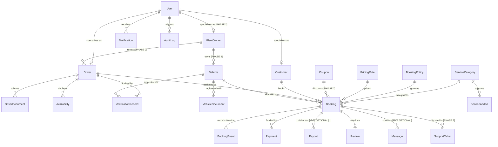

# ShadiDriver - Relational Database Schema & Data Models

**Document Version:** 1.1.0  
**Status:** REFINED DATA MODEL SPECIFICATION  
**Author:** Lead Software Architect  
**Engine:** Relational SQL (PostgreSQL 16+ Recommended / PostGIS Enabled)  

---

## 1. Schema Phasing & Implementation Classification

To ensure a focused, high-quality launch for the wedding season pilot, all database tables are categorized by implementation phase:

```
┌──────────────────────────────────────────────────────────────────────────────────────────┐
│                                 DATABASE TABLE PHASING                                   │
├──────────────────────────────────────────────────────────────────────────────────────────┤
│ [MVP REQUIRED] - Essential for Single-City Wedding Pilot                                │
│   • users                  : Central identity and authentication records                │
│   • customers              : Customer profiles and emergency contacts                   │
│   • drivers                : Chauffeur profiles, experience, and online status          │
│   • vehicles               : Luxury fleet assets and seating capacities                 │
│   • driver_documents       : Chauffeur compliance credentials (DL, ID, Police NOC)       │
│   • vehicle_documents      : Vehicle commercial records (RC, Insurance, PUC, Fitness)   │
│   • verification_records   : Audit trail of admin verification decisions                │
│   • availabilities         : Driver/Vehicle time-slot locks preventing double-booking   │
│   • service_categories     : Wedding ceremony catalog (Baraat, Vidai, Entry, etc.)     │
│   • service_addons         : Customizations (Ceremonial attire, floral coordination)    │
│   • pricing_rules          : Dynamic rate cards, overages, and muhurat multipliers      │
│   • booking_policies       : Configurable token percentages and cancellation schedules  │
│   • bookings               : Central transactional booking records                      │
│   • booking_events         : Immutable append-only state transition audit trail         │
│   • payments               : Advance token and settlement payment transaction records   │
│   • reviews                : Customer ratings on punctuality, grooming, and driving     │
│   • notifications          : Push and in-app customer/driver alerts                     │
│   • audit_logs             : Security-sensitive administrative action logs              │
├──────────────────────────────────────────────────────────────────────────────────────────┤
│ [MVP OPTIONAL] - Pilot Desirable, Can Fall Back to Manual/Simpler Alternatives           │
│   • payouts                : Basic disbursement tracking (can be manual bank transfer)  │
│   • messages               : In-app messaging (can use masked telephony/WhatsApp proxy) │
├──────────────────────────────────────────────────────────────────────────────────────────┤
│ [PHASE 2] - Agency Fleets, Multi-City Expansion & Promotion                             │
│   • fleet_owners           : Multi-vehicle agency accounts and driver rostering         │
│   • coupons                : Promotional discount codes and marketing vouchers          │
│   • support_tickets        : Structured operational dispute and complaint tracking      │
├──────────────────────────────────────────────────────────────────────────────────────────┤
│ [PHASE 3+] - Enterprise Scale & Automation                                              │
│   • double_entry_ledger    : Multi-party financial ledger (accounts, debits, credits)   │
│   • fleet_settlements      : Automated multi-party revenue share splits                 │
└──────────────────────────────────────────────────────────────────────────────────────────┘
```

---

## 2. Technical Infrastructure Confidence Levels

* **Primary Keys**: `[RECOMMENDED BUT NOT YET FINAL - UUIDv7]`  
  * *Rationale*: Time-sortable, eliminates B-Tree index fragmentation under high write loads.  
  * *Fallback*: Standard UUIDv4 or database-generated UUIDs (`gen_random_uuid()`) if UUIDv7 extensions are unavailable.
* **Geospatial Coordinates**: `[RECOMMENDED BUT NOT YET FINAL - PostGIS GEOGRAPHY(POINT, 4326)]`  
  * *Rationale*: Enables native radial proximity queries (`ST_DWithin`) and geofencing for banquet venues.  
  * *Fallback*: Standard `DECIMAL(10, 7)` latitude/longitude pairs utilizing spherical Haversine formulas in standard SQL.
* **Double-Entry Escrow Ledger**: `[RECOMMENDED BUT NOT YET FINAL - Simplified for MVP]`  
  * *Rationale*: MVP tracks payment intents and receipts in `payments` and `payouts` tables. Full double-entry balance sheets (`ledger_entries`) are deferred to Phase 3.

---

## 3. Entity Relationship Diagram (ERD)



---

## 4. Table Schema Definitions

### 4.1 Identity & Actors

#### `users` `[MVP REQUIRED]`
Central identity registry for all user types.
```sql
CREATE TABLE users (
    id UUID PRIMARY KEY DEFAULT gen_random_uuid(),
    phone_number VARCHAR(15) UNIQUE NOT NULL, -- E.164 format (+91...)
    country_code VARCHAR(5) DEFAULT '+91',
    email VARCHAR(255) UNIQUE,
    full_name VARCHAR(150) NOT NULL,
    avatar_url TEXT,
    primary_role VARCHAR(30) NOT NULL, -- CUSTOMER, DRIVER, FLEET_OWNER, OPERATIONS_ADMIN, VERIFICATION_ADMIN, FINANCE_ADMIN, SUPER_ADMIN
    is_active BOOLEAN DEFAULT TRUE,
    is_phone_verified BOOLEAN DEFAULT FALSE,
    created_at TIMESTAMPTZ DEFAULT CURRENT_TIMESTAMP,
    updated_at TIMESTAMPTZ DEFAULT CURRENT_TIMESTAMP,
    deleted_at TIMESTAMPTZ
);
CREATE INDEX idx_users_phone ON users(phone_number);
CREATE INDEX idx_users_role ON users(primary_role);
```

#### `customers` `[MVP REQUIRED]`
Extended profile for wedding hosts and event planners.
```sql
CREATE TABLE customers (
    id UUID PRIMARY KEY REFERENCES users(id) ON DELETE CASCADE,
    emergency_contact_name VARCHAR(150),
    emergency_contact_phone VARCHAR(15),
    billing_address JSONB,
    gstin VARCHAR(15), -- Optional corporate GST number
    preferred_language VARCHAR(20) DEFAULT 'en',
    created_at TIMESTAMPTZ DEFAULT CURRENT_TIMESTAMP,
    updated_at TIMESTAMPTZ DEFAULT CURRENT_TIMESTAMP
);
```

#### `drivers` `[MVP REQUIRED]`
Professional chauffeurs available for booking dispatch.
```sql
CREATE TABLE drivers (
    id UUID PRIMARY KEY REFERENCES users(id) ON DELETE CASCADE,
    fleet_owner_id UUID, -- References fleet_owners(id) in Phase 2
    date_of_birth DATE NOT NULL,
    experience_years INT NOT NULL CHECK (experience_years >= 0),
    languages_spoken TEXT[] DEFAULT '{"Hindi"}',
    ceremonial_attire_sizes JSONB, -- { "suit": "40R", "safa": "L", "height_cm": 178 }
    verification_status VARCHAR(30) DEFAULT 'PENDING_SUBMISSION', -- PENDING_SUBMISSION, SUBMITTED, UNDER_REVIEW, APPROVED, ACTION_REQUIRED, SUSPENDED
    is_online BOOLEAN DEFAULT FALSE,
    current_location GEOGRAPHY(POINT, 4326), -- PostGIS Point
    last_location_update TIMESTAMPTZ,
    average_rating NUMERIC(3, 2) DEFAULT 5.00,
    total_trips_completed INT DEFAULT 0,
    created_at TIMESTAMPTZ DEFAULT CURRENT_TIMESTAMP,
    updated_at TIMESTAMPTZ DEFAULT CURRENT_TIMESTAMP
);
CREATE INDEX idx_drivers_status ON drivers(verification_status);
CREATE INDEX idx_drivers_geo ON drivers USING GIST(current_location);
```

#### `vehicles` `[MVP REQUIRED]`
Luxury vehicles deployed for ceremonial bookings.
```sql
CREATE TABLE vehicles (
    id UUID PRIMARY KEY DEFAULT gen_random_uuid(),
    independent_driver_id UUID REFERENCES drivers(id) ON DELETE SET NULL,
    fleet_owner_id UUID, -- References fleet_owners(id) in Phase 2
    make VARCHAR(50) NOT NULL, -- Mercedes-Benz, BMW, Toyota
    model VARCHAR(50) NOT NULL, -- E-Class, 5 Series, Innova HyCross
    year_of_manufacture INT NOT NULL,
    color VARCHAR(30) NOT NULL,
    registration_number VARCHAR(20) UNIQUE NOT NULL,
    seating_capacity INT NOT NULL,
    fuel_type VARCHAR(20) NOT NULL,
    vehicle_class VARCHAR(40) NOT NULL, -- LUXURY_SEDAN, ULTRA_LUXURY, VINTAGE, EXECUTIVE_MPV
    is_vintage BOOLEAN DEFAULT FALSE,
    air_conditioning_type VARCHAR(30) DEFAULT 'DUAL_CLIMATE_CONTROL',
    verification_status VARCHAR(30) DEFAULT 'PENDING_SUBMISSION',
    is_active BOOLEAN DEFAULT TRUE,
    created_at TIMESTAMPTZ DEFAULT CURRENT_TIMESTAMP,
    updated_at TIMESTAMPTZ DEFAULT CURRENT_TIMESTAMP
);
CREATE INDEX idx_vehicles_class ON vehicles(vehicle_class);
CREATE INDEX idx_vehicles_status ON vehicles(verification_status);
```

#### `fleet_owners` `[PHASE 2]`
Commercial vehicle fleet agencies.
```sql
CREATE TABLE fleet_owners (
    id UUID PRIMARY KEY REFERENCES users(id) ON DELETE CASCADE,
    company_name VARCHAR(200) NOT NULL,
    trade_license_number VARCHAR(100),
    pan_number VARCHAR(10),
    gstin VARCHAR(15),
    bank_account_details JSONB,
    verification_status VARCHAR(30) DEFAULT 'PENDING',
    created_at TIMESTAMPTZ DEFAULT CURRENT_TIMESTAMP,
    updated_at TIMESTAMPTZ DEFAULT CURRENT_TIMESTAMP
);
```

---

### 4.2 Compliance & Documents

#### `driver_documents` `[MVP REQUIRED]`
```sql
CREATE TABLE driver_documents (
    id UUID PRIMARY KEY DEFAULT gen_random_uuid(),
    driver_id UUID NOT NULL REFERENCES drivers(id) ON DELETE CASCADE,
    document_type VARCHAR(40) NOT NULL, -- DRIVING_LICENCE, AADHAAR_MASKED, POLICE_VERIFICATION, CHAUFFEUR_CERTIFICATE
    document_number VARCHAR(100),
    storage_path TEXT NOT NULL, -- Private S3 bucket key
    mime_type VARCHAR(50) NOT NULL,
    issued_date DATE,
    expiry_date DATE,
    verification_status VARCHAR(30) DEFAULT 'PENDING_REVIEW', -- PENDING_REVIEW, VERIFIED, REJECTED, EXPIRED
    rejection_reason TEXT,
    verified_by UUID REFERENCES users(id),
    verified_at TIMESTAMPTZ,
    created_at TIMESTAMPTZ DEFAULT CURRENT_TIMESTAMP,
    updated_at TIMESTAMPTZ DEFAULT CURRENT_TIMESTAMP,
    CONSTRAINT uk_driver_doc UNIQUE(driver_id, document_type)
);
CREATE INDEX idx_driver_docs_expiry ON driver_documents(expiry_date);
```

#### `vehicle_documents` `[MVP REQUIRED]`
```sql
CREATE TABLE vehicle_documents (
    id UUID PRIMARY KEY DEFAULT gen_random_uuid(),
    vehicle_id UUID NOT NULL REFERENCES vehicles(id) ON DELETE CASCADE,
    document_type VARCHAR(40) NOT NULL, -- REGISTRATION_CERTIFICATE, INSURANCE, PUC, FITNESS_CERTIFICATE, PERMIT
    document_number VARCHAR(100),
    storage_path TEXT NOT NULL,
    issued_date DATE,
    expiry_date DATE,
    verification_status VARCHAR(30) DEFAULT 'PENDING_REVIEW',
    rejection_reason TEXT,
    verified_by UUID REFERENCES users(id),
    verified_at TIMESTAMPTZ,
    created_at TIMESTAMPTZ DEFAULT CURRENT_TIMESTAMP,
    updated_at TIMESTAMPTZ DEFAULT CURRENT_TIMESTAMP,
    CONSTRAINT uk_vehicle_doc UNIQUE(vehicle_id, document_type)
);
CREATE INDEX idx_vehicle_docs_expiry ON vehicle_documents(expiry_date);
```

#### `verification_records` `[MVP REQUIRED]`
Immutable audit trail of all KYC decisions.
```sql
CREATE TABLE verification_records (
    id UUID PRIMARY KEY DEFAULT gen_random_uuid(),
    admin_id UUID NOT NULL REFERENCES users(id),
    target_type VARCHAR(20) NOT NULL, -- DRIVER, VEHICLE
    target_id UUID NOT NULL,
    previous_status VARCHAR(30) NOT NULL,
    new_status VARCHAR(30) NOT NULL,
    decision_reason TEXT,
    verification_metadata JSONB,
    created_at TIMESTAMPTZ DEFAULT CURRENT_TIMESTAMP
);
```

---

### 4.3 Catalog, Pricing & Policies

#### `service_categories` `[MVP REQUIRED]`
```sql
CREATE TABLE service_categories (
    id VARCHAR(50) PRIMARY KEY, -- SVC_BARAAT, SVC_VIDAI, SVC_MULTIDAY, SVC_RECEPTION
    title VARCHAR(100) NOT NULL,
    description TEXT NOT NULL,
    display_order INT DEFAULT 0,
    is_active BOOLEAN DEFAULT TRUE,
    created_at TIMESTAMPTZ DEFAULT CURRENT_TIMESTAMP
);
```

#### `service_addons` `[MVP REQUIRED]`
```sql
CREATE TABLE service_addons (
    id UUID PRIMARY KEY DEFAULT gen_random_uuid(),
    service_category_id VARCHAR(50) REFERENCES service_categories(id),
    name VARCHAR(150) NOT NULL,
    description TEXT,
    price_cents BIGINT NOT NULL, -- In Indian Paise
    is_active BOOLEAN DEFAULT TRUE,
    created_at TIMESTAMPTZ DEFAULT CURRENT_TIMESTAMP
);
```

#### `pricing_rules` `[MVP REQUIRED]`
Dynamic rate cards and surge multipliers.
```sql
CREATE TABLE pricing_rules (
    id UUID PRIMARY KEY DEFAULT gen_random_uuid(),
    service_category_id VARCHAR(50) REFERENCES service_categories(id),
    vehicle_class VARCHAR(40) NOT NULL,
    city_code VARCHAR(10) NOT NULL, -- DEL, JAI, UDR, MUM
    base_hours INT NOT NULL,
    base_km INT NOT NULL,
    base_rate_cents BIGINT NOT NULL,
    extra_hour_rate_cents BIGINT NOT NULL,
    extra_km_rate_cents BIGINT NOT NULL,
    night_allowance_cents BIGINT DEFAULT 0,
    muhurat_multiplier NUMERIC(3,2) DEFAULT 1.00,
    effective_from TIMESTAMPTZ NOT NULL,
    effective_to TIMESTAMPTZ,
    is_active BOOLEAN DEFAULT TRUE,
    created_at TIMESTAMPTZ DEFAULT CURRENT_TIMESTAMP
);
CREATE INDEX idx_pricing_rules_lookup ON pricing_rules(service_category_id, vehicle_class, city_code);
```

#### `booking_policies` `[MVP REQUIRED]`
```sql
CREATE TABLE booking_policies (
    id UUID PRIMARY KEY DEFAULT gen_random_uuid(),
    policy_name VARCHAR(100) NOT NULL,
    token_percentage NUMERIC(5,2) NOT NULL,
    cancellation_rules JSONB NOT NULL,
    grace_period_minutes INT DEFAULT 30,
    overtime_increment_minutes INT DEFAULT 30,
    is_default BOOLEAN DEFAULT FALSE,
    created_at TIMESTAMPTZ DEFAULT CURRENT_TIMESTAMP
);
```

---

### 4.4 Bookings & Lifecycle

#### `availabilities` `[MVP REQUIRED]`
Time-slot locking table preventing double-booking.
```sql
CREATE TABLE availabilities (
    id UUID PRIMARY KEY DEFAULT gen_random_uuid(),
    driver_id UUID REFERENCES drivers(id) ON DELETE CASCADE,
    vehicle_id UUID REFERENCES vehicles(id) ON DELETE CASCADE,
    start_time TIMESTAMPTZ NOT NULL,
    end_time TIMESTAMPTZ NOT NULL,
    status VARCHAR(30) DEFAULT 'AVAILABLE', -- AVAILABLE, BLOCKED, BOOKED, MAINTENANCE
    booking_id UUID,
    created_at TIMESTAMPTZ DEFAULT CURRENT_TIMESTAMP,
    CONSTRAINT ck_time_range CHECK (end_time > start_time)
);
CREATE INDEX idx_avail_driver_time ON availabilities(driver_id, start_time, end_time);
CREATE INDEX idx_avail_vehicle_time ON availabilities(vehicle_id, start_time, end_time);
```

#### `bookings` `[MVP REQUIRED]`
Central transactional entity.
```sql
CREATE TABLE bookings (
    id UUID PRIMARY KEY DEFAULT gen_random_uuid(),
    booking_reference VARCHAR(20) UNIQUE NOT NULL,
    customer_id UUID NOT NULL REFERENCES customers(id),
    driver_id UUID REFERENCES drivers(id),
    vehicle_id UUID REFERENCES vehicles(id),
    service_category_id VARCHAR(50) NOT NULL REFERENCES service_categories(id),
    pricing_rule_id UUID NOT NULL REFERENCES pricing_rules(id),
    booking_policy_id UUID NOT NULL REFERENCES booking_policies(id),
    
    status VARCHAR(40) NOT NULL DEFAULT 'REQUESTED',

    event_start_time TIMESTAMPTZ NOT NULL,
    event_end_time TIMESTAMPTZ NOT NULL,
    pickup_address TEXT NOT NULL,
    pickup_location GEOGRAPHY(POINT, 4326) NOT NULL,
    ceremony_venue_name VARCHAR(200),
    destination_address TEXT,
    destination_location GEOGRAPHY(POINT, 4326),
    itinerary_notes TEXT,
    
    selected_attire VARCHAR(50),
    selected_addons JSONB DEFAULT '[]',
    special_instructions TEXT,
    
    estimated_base_fare_cents BIGINT NOT NULL,
    addon_fare_cents BIGINT DEFAULT 0,
    discount_cents BIGINT DEFAULT 0,
    tax_cents BIGINT NOT NULL,
    total_estimated_amount_cents BIGINT NOT NULL,
    advance_token_cents BIGINT NOT NULL,
    final_settled_amount_cents BIGINT,
    
    version INT DEFAULT 1, -- Optimistic concurrency locking
    created_at TIMESTAMPTZ DEFAULT CURRENT_TIMESTAMP,
    updated_at TIMESTAMPTZ DEFAULT CURRENT_TIMESTAMP
);
CREATE INDEX idx_bookings_customer ON bookings(customer_id);
CREATE INDEX idx_bookings_driver ON bookings(driver_id);
CREATE INDEX idx_bookings_status ON bookings(status);
CREATE INDEX idx_bookings_date ON bookings(event_start_time);
```

#### `booking_events` `[MVP REQUIRED]`
Immutable append-only state transition audit log.
```sql
CREATE TABLE booking_events (
    id UUID PRIMARY KEY DEFAULT gen_random_uuid(),
    booking_id UUID NOT NULL REFERENCES bookings(id) ON DELETE CASCADE,
    from_status VARCHAR(40) NOT NULL,
    to_status VARCHAR(40) NOT NULL,
    triggered_by_user_id UUID NOT NULL REFERENCES users(id),
    trigger_role VARCHAR(30) NOT NULL,
    event_reason TEXT,
    event_metadata JSONB,
    created_at TIMESTAMPTZ DEFAULT CURRENT_TIMESTAMP
);
CREATE INDEX idx_booking_events_booking ON booking_events(booking_id, created_at);
```

---

### 4.5 Financials, Communication & Audit

#### `payments` `[MVP REQUIRED]`
Advance token and balance settlement records.
```sql
CREATE TABLE payments (
    id UUID PRIMARY KEY DEFAULT gen_random_uuid(),
    booking_id UUID NOT NULL REFERENCES bookings(id),
    customer_id UUID NOT NULL REFERENCES customers(id),
    payment_type VARCHAR(30) NOT NULL, -- ADVANCE_TOKEN, BALANCE_SETTLEMENT, OVERTIME_CHARGE, TIP
    amount_cents BIGINT NOT NULL,
    currency VARCHAR(3) DEFAULT 'INR',
    gateway VARCHAR(30) NOT NULL,
    gateway_order_id VARCHAR(100),
    gateway_payment_id VARCHAR(100),
    gateway_signature VARCHAR(255),
    status VARCHAR(30) DEFAULT 'INITIATED', -- INITIATED, SUCCESS, FAILED, REFUNDED
    failure_code VARCHAR(50),
    failure_message TEXT,
    idempotency_key VARCHAR(100) UNIQUE,
    paid_at TIMESTAMPTZ,
    created_at TIMESTAMPTZ DEFAULT CURRENT_TIMESTAMP
);
CREATE INDEX idx_payments_booking ON payments(booking_id);
CREATE INDEX idx_payments_gateway_order ON payments(gateway_order_id);
```

#### `payouts` `[MVP OPTIONAL]`
Disbursements to drivers.
```sql
CREATE TABLE payouts (
    id UUID PRIMARY KEY DEFAULT gen_random_uuid(),
    booking_id UUID NOT NULL REFERENCES bookings(id),
    beneficiary_user_id UUID NOT NULL REFERENCES users(id),
    beneficiary_role VARCHAR(30) NOT NULL,
    gross_amount_cents BIGINT NOT NULL,
    platform_commission_cents BIGINT NOT NULL,
    tds_deduction_cents BIGINT NOT NULL,
    net_payout_cents BIGINT NOT NULL,
    status VARCHAR(30) DEFAULT 'PENDING',
    transfer_reference VARCHAR(100),
    processed_at TIMESTAMPTZ,
    created_at TIMESTAMPTZ DEFAULT CURRENT_TIMESTAMP
);
CREATE INDEX idx_payouts_beneficiary ON payouts(beneficiary_user_id);
```

#### `reviews` `[MVP REQUIRED]`
Post-ceremony customer feedback.
```sql
CREATE TABLE reviews (
    id UUID PRIMARY KEY DEFAULT gen_random_uuid(),
    booking_id UUID UNIQUE NOT NULL REFERENCES bookings(id),
    customer_id UUID NOT NULL REFERENCES customers(id),
    driver_id UUID NOT NULL REFERENCES drivers(id),
    vehicle_id UUID NOT NULL REFERENCES vehicles(id),
    overall_rating INT NOT NULL CHECK (overall_rating BETWEEN 1 AND 5),
    punctuality_rating INT CHECK (punctuality_rating BETWEEN 1 AND 5),
    grooming_rating INT CHECK (grooming_rating BETWEEN 1 AND 5),
    cleanliness_rating INT CHECK (cleanliness_rating BETWEEN 1 AND 5),
    driving_rating INT CHECK (driving_rating BETWEEN 1 AND 5),
    feedback_text TEXT,
    created_at TIMESTAMPTZ DEFAULT CURRENT_TIMESTAMP
);
```

#### `messages` `[MVP OPTIONAL]`
In-app text messaging between customer and driver.
```sql
CREATE TABLE messages (
    id UUID PRIMARY KEY DEFAULT gen_random_uuid(),
    booking_id UUID NOT NULL REFERENCES bookings(id) ON DELETE CASCADE,
    sender_id UUID NOT NULL REFERENCES users(id),
    recipient_id UUID NOT NULL REFERENCES users(id),
    message_type VARCHAR(20) DEFAULT 'TEXT',
    body TEXT NOT NULL,
    is_read BOOLEAN DEFAULT FALSE,
    created_at TIMESTAMPTZ DEFAULT CURRENT_TIMESTAMP
);
CREATE INDEX idx_messages_booking ON messages(booking_id, created_at);
```

#### `notifications` `[MVP REQUIRED]`
User alert notifications.
```sql
CREATE TABLE notifications (
    id UUID PRIMARY KEY DEFAULT gen_random_uuid(),
    user_id UUID NOT NULL REFERENCES users(id) ON DELETE CASCADE,
    title VARCHAR(150) NOT NULL,
    body TEXT NOT NULL,
    data_payload JSONB,
    is_read BOOLEAN DEFAULT FALSE,
    created_at TIMESTAMPTZ DEFAULT CURRENT_TIMESTAMP
);
CREATE INDEX idx_notifications_user ON notifications(user_id);
```

#### `coupons` `[PHASE 2]`
Promotional discounts.
```sql
CREATE TABLE coupons (
    id UUID PRIMARY KEY DEFAULT gen_random_uuid(),
    code VARCHAR(30) UNIQUE NOT NULL,
    discount_percentage NUMERIC(5,2),
    max_discount_cents BIGINT,
    min_booking_amount_cents BIGINT,
    valid_from TIMESTAMPTZ NOT NULL,
    valid_to TIMESTAMPTZ NOT NULL,
    is_active BOOLEAN DEFAULT TRUE,
    created_at TIMESTAMPTZ DEFAULT CURRENT_TIMESTAMP
);
```

#### `support_tickets` `[PHASE 2]`
Operational dispute tracking.
```sql
CREATE TABLE support_tickets (
    id UUID PRIMARY KEY DEFAULT gen_random_uuid(),
    booking_id UUID REFERENCES bookings(id),
    reported_by_user_id UUID NOT NULL REFERENCES users(id),
    category VARCHAR(50) NOT NULL, -- DELAY, VEHICLE_BREAKDOWN, GROOMING_ISSUE, BILLING_DISPUTE
    status VARCHAR(30) DEFAULT 'OPEN', -- OPEN, INVESTIGATING, RESOLVED, CLOSED
    assigned_admin_id UUID REFERENCES users(id),
    created_at TIMESTAMPTZ DEFAULT CURRENT_TIMESTAMP,
    updated_at TIMESTAMPTZ DEFAULT CURRENT_TIMESTAMP
);
```

#### `audit_logs` `[MVP REQUIRED]`
Global administrative and security activity log.
```sql
CREATE TABLE audit_logs (
    id UUID PRIMARY KEY DEFAULT gen_random_uuid(),
    actor_id UUID REFERENCES users(id),
    actor_role VARCHAR(30),
    action VARCHAR(100) NOT NULL,
    target_entity VARCHAR(50),
    target_id UUID,
    ip_address INET,
    user_agent TEXT,
    changes JSONB,
    created_at TIMESTAMPTZ DEFAULT CURRENT_TIMESTAMP
);
CREATE INDEX idx_audit_logs_actor ON audit_logs(actor_id);
CREATE INDEX idx_audit_logs_action ON audit_logs(action);
```
