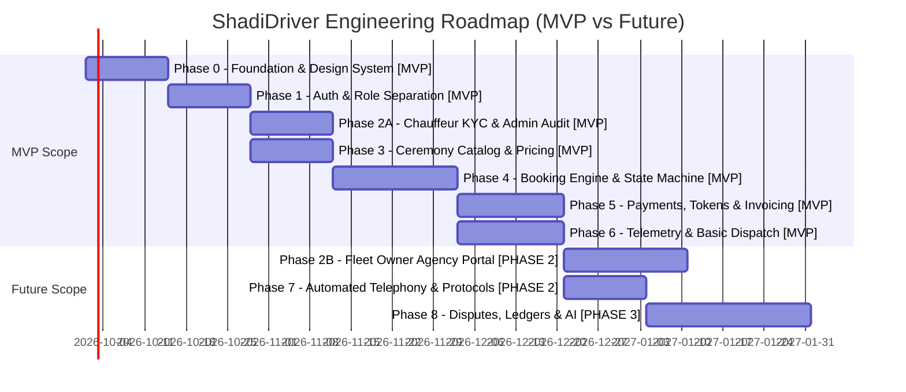

# ShadiDriver - Phased Engineering Roadmap & Implementation Plan

**Document Version:** 1.1.0  
**Status:** REFINED ENGINEERING ROADMAP  
**Author:** Lead Software Architect  
**Methodology:** Milestone-Driven Agile / Strict Scope Phasing  

---

## 1. Scope Phasing Strategy

To ensure a flawless launch for the upcoming Indian wedding season, engineering is bifurcated into **MVP Pilot Scope** and **Future Scale Scope**:

```
┌──────────────────────────────────────────────────────────────────────────────────────────┐
│                               SCOPE SEPARATION MATRIX                                    │
├──────────────────────────────────────────────────────────────────────────────────────────┤
│ MVP PILOT SCOPE (Target: Single-City Wedding Season Launch - Delhi NCR / Jaipur)         │
│   • Target Users      : Customers (Wedding Hosts) & Independent Professional Chauffeurs  │
│   • Core Ceremonies   : Baraat, Vidai, Bride/Groom Entry, Reception VIP                  │
│   • Verification      : Manual Admin Document Audit (DL, RC, Insurance, Police NOC)       │
│   • Booking Flow      : Advance Token (Gateway Checkout) + Server State Machine          │
│   • Operations        : Admin Control Room for manual dispatch overrides & emergency SOS │
│   • Communication     : Direct proxy/dispatcher relay (Basic number masking)             │
│   • Telemetry         : Real-time driver GPS streaming during ARRIVING and TRIP_STARTED  │
├──────────────────────────────────────────────────────────────────────────────────────────┤
│ PHASE 2 SCOPE (Multi-City Expansion & Fleet Agencies)                                    │
│   • Fleet Portal      : Multi-vehicle agency accounts and driver-vehicle rostering       │
│   • Auto-Verification : Automated DigiLocker API & Vahan registry integration            │
│   • Telephony Bridge  : Automated in-app virtual VoIP / PSTN proxy bridge (Exotel)       │
│   • Marketing         : Promotional coupon engine and referral program                   │
│   • Support Desk      : In-app structured dispute mediation and ticketing               │
├──────────────────────────────────────────────────────────────────────────────────────────┤
│ PHASE 3+ SCOPE (Enterprise Scale & Intelligent Operations)                               │
│   • Financials        : Full double-entry ledger & automated instant bank payouts (IMPS) │
│   • AI Dispatch       : Algorithmic standby chauffeur pooling and convoy dispatch        │
│   • Enterprise B2B    : Wedding planner agency bulk booking portal                       │
└──────────────────────────────────────────────────────────────────────────────────────────┘
```

---

## 2. Phase-by-Phase Technical Roadmap



---

## 3. Detailed Phase Deliverables

### Phase 0: Foundation, Architecture & Design System Setup `[MVP REQUIRED]`
* **Objectives**: Initialize clean architecture skeleton, Riverpod state foundation, GoRouter configuration, and luxury design tokens.
* **Deliverables**:
  * Clean architecture folder hierarchy (`lib/core`, `lib/features`, `lib/services`).
  * Material 3 Theme setup: Deep Burgundy (`#58111A`), Dark Burgundy (`#3B0910`), Champagne Gold (`#D4AF37`), Ivory (`#FDFBF7`).
  * Typography pairing: `Playfair Display` for ceremonial headings, `Plus Jakarta Sans` for UI/body text.
  * Riverpod 2.x setup with base state observers and error boundaries.
  * GoRouter configuration with role-based route guards.
  * Dio API client configured with correlation IDs and error mapping.
* **Exit Criteria**: Clean build on iOS, Android, and Web with 0 lint warnings; design system widget catalog functional.

### Phase 1: Authentication, Identity & Role Separation `[MVP REQUIRED]`
* **Objectives**: Implement Phone OTP authentication, secure hardware-backed session persistence, and role segregation.
* **Deliverables**:
  * Phone OTP request and verification screens with cooldown countdown timers.
  * Hardware-backed token storage via `FlutterSecureStorage` (Keychain / Keystore).
  * Role selection & boundary handling (`CUSTOMER`, `DRIVER`, `ADMIN`).
  * GoRouter auth redirect guards preventing unauthorized route access.
* **Exit Criteria**: User logs in, receives signed JWTs, stores session securely, and is routed to their role-specific dashboard.

### Phase 2A: Chauffeur & Vehicle KYC Pipeline (Independent Drivers) `[MVP REQUIRED]`
* **Objectives**: Implement independent driver and vehicle onboarding, document capture, and admin review console.
* **Deliverables**:
  * Driver document upload flow (DL, Masked Aadhaar, Police NOC, Chauffeur Certificate).
  * Vehicle registration flow (RC, Insurance, PUC, Fitness, Tourist Permit, 360° photos).
  * S3 private document upload via short-lived presigned URLs.
  * Admin Verification Queue: document viewer with approval/rejection reason forms.
* **Exit Criteria**: Complete end-to-end flow: Driver registers -> uploads credentials -> Admin reviews -> Driver transitions to `APPROVED`.

### Phase 3: Catalog, Ceremonial Addons & Dynamic Pricing `[MVP REQUIRED]`
* **Objectives**: Build ceremony catalog, vehicle tier selector, and dynamic quotation engine.
* **Deliverables**:
  * Service category showcase (Baraat, Vidai, Entry, Multi-day, Reception).
  * Addon selection (Chauffeur Safa/Jodhpuri attire, floral coordination, amenities).
  * Server-authoritative price estimation calculator respecting base hours, base km, and muhurat multipliers.
* **Exit Criteria**: Customer configures wedding ceremony package and receives an accurate, itemized quotation.

### Phase 4: Booking Engine & State Machine Implementation `[MVP REQUIRED]`
* **Objectives**: Implement server-authoritative booking lifecycle and customer/driver booking interfaces.
* **Deliverables**:
  * Booking creation wizard with itinerary, date/time pickers, and ceremonial instructions.
  * Server state machine with optimistic concurrency locking (`version` checks).
  * Driver job offer modal with ceremony briefing, dress code, and payout summary.
  * Real-time booking status tracking stepper widget showing live ceremony milestones.
* **Exit Criteria**: A booking transitions through `REQUESTED` -> `DRIVER_ACCEPTED` -> `CONFIRMED` -> `DRIVER_ASSIGNED` without concurrency glitches.

### Phase 5: Payments, Advance Tokens & Automated Invoicing `[MVP REQUIRED]`
* **Objectives**: Payment gateway checkout integration for advance tokens, webhook reconciliation, and invoice generation.
* **Deliverables**:
  * Payment gateway checkout SDK integration (`[RECOMMENDED: Razorpay / Cashfree]`) with strict idempotency keys.
  * Advance token capture workflow with retry logic for declined transactions.
  * Balance settlement calculation including overage hours.
  * Automated GST compliant invoice PDF generation.
* **Exit Criteria**: Advance token successfully captured; webhook reconciles booking to `CONFIRMED`; invoice downloadable.

### Phase 6: Real-Time Telemetry & Basic Dispatch Control Room `[MVP REQUIRED]`
* **Objectives**: Real-time chauffeur tracking and operations control room for wedding monitoring.
* **Deliverables**:
  * Driver background location streaming service (battery-optimized).
  * Customer live map tracking screen showing vehicle bearing, route polyline, and accurate ETA.
  * Admin Live Dispatch Control Room displaying active wedding cars on a city map.
  * Emergency Standby Chauffeur single-click reassignment workflow.
* **Exit Criteria**: Vehicle location updates stream with `< 3s` latency; control room can reassign an active trip in under 10 seconds.

### Phase 2B: Agency Fleet Management Portal `[PHASE 2]`
* Multi-vehicle agency accounts, fleet-level driver assignment, and aggregated agency revenue reports.

### Phase 7: Automated Masked Telephony & Ceremonial Checklists `[PHASE 2]`
* Automated in-app virtual number proxy bridge (Exotel/Twilio); pre-trip grooming selfie AI validation.

### Phase 8: Automated Payout Ledgers, Dispute Desk & AI Dispatch `[PHASE 3+]`
* Double-entry ledger with instant IMPS/UPI driver disbursements, structured dispute mediation desk, and algorithmic standby fleet pooling.

---

## 4. Risk Assessment & Operational Mitigations

| Operational / Technical Risk | Impact | Likelihood | Scope | Architectural & Operational Mitigation |
| :--- | :---: | :---: | :---: | :--- |
| **Baraat Procession Delayed 2+ Hours** | High | **Very High** | **MVP** | System introduces "Ceremonial Delay Grace" mode. Chauffeur is barred from unilateral abandonment; overage billing automatically applies; control room monitors driver fatigue. |
| **Chauffeur No-Show / Vehicle Breakdown** | **Critical** | Medium | **MVP** | Dedicated Standby Pool of pre-vetted chauffeurs stationed in key banquet zones; instant `EMERGENCY_REPLACEMENT` protocol in admin dashboard. |
| **Zero Cellular Reception at Wedding Resort** | High | High | **MVP** | Offline-first SQLite/Isar cache in Driver App. State transitions and timestamps logged locally with cryptographic signatures and synced automatically once online. |
| **Auspicious Muhurat Date Surges** | High | High | **MVP** | Platform capacity caps based on available vetted chauffeur fleet. Early reservation deposit tiers incentivize booking weeks in advance. |
| **Firecracker / Procession Vehicle Damage** | Medium | Medium | **Phase 2** | Clear pre-trip 12-point photo inspection logged in cloud before entry; terms of service explicitly outline liability policies and event insurance options. |

---

## 5. Business Decisions Requiring Executive Confirmation

> [!CAUTION]
> The engineering team cannot implement billing and policy automation until the executive committee formally approves the following parameters:

| Decision Item | Key Alternatives | Scope Impact |
| :--- | :--- | :--- |
| **Advance Token Amount** | 20% vs 50% vs 100% Upfront | **MVP**: Governs payment gateway checkout sizing and balance settlement logic. |
| **Cancellation Refund Schedule** | Tiered (30d: 100%, 7d: 50%, <7d: 0%) vs Flat Fee | **MVP**: Governs the automated refund calculation inside `payments` and `bookings` tables. |
| **Chauffeur Ceremonial Uniforms** | Platform Capex (Supplied) vs Chauffeur Sourced | **MVP**: Determines whether uniform inventory tracking is needed in the Fleet/Driver portal. |
| **Baraat Damage Deposit** | Refundable deposit collected from host vs Add-on insurance | **Phase 2**: Requires building pre-authorization hold on credit cards or third-party insurance API. |
| **Platform Commission Rate** | Flat percentage (e.g. 15-25%) vs Tiered subscription | **MVP**: Dictates payout calculation formulas in `payouts` ledger. |
