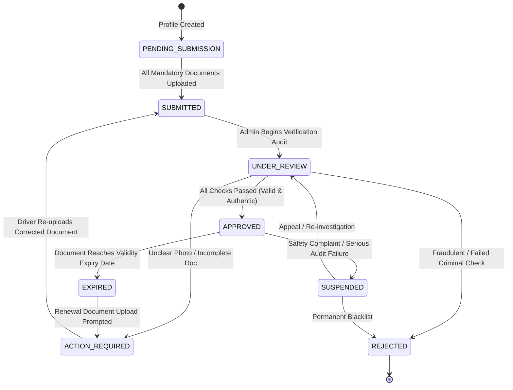

# ShadiDriver - Chauffeur & Vehicle Verification System (KYC/V-KYC)

**Document Version:** 1.0.0  
**Status:** APPROVED COMPLIANCE SPECIFICATION  
**Author:** Lead Software Architect  
**Domain:** Trust, Safety, Legal & Verification Operations  

---

## 1. Verification State Machine

Both Chauffeur profiles and Vehicle assets adhere to a strict verification lifecycle. A chauffeur cannot be dispatched or accept a booking unless **both the driver and vehicle are in `APPROVED` status**.



---

## 2. Document Requirements & Standards

### 2.1 Chauffeur (Driver) Verification Portfolio
Every chauffeur must submit and pass verification across the following 6 documents:

| Document Key | Name | Mandatory? | Official Registry Source | Validation Criteria |
| :--- | :--- | :--- | :--- | :--- |
| `DOC_DL` | **Driving Licence** | **Yes** | MoRTH Parivahan / Sarathi API | Valid commercial/LMV-TR endorsement; minimum 3 years driving experience; not suspended. |
| `DOC_AADHAAR` | **Government ID** | **Yes** | DigiLocker / UIDAI Gateway | Masked Aadhaar (first 8 digits masked) or verified via DigiLocker token. Name and DOB match DL exactly. |
| `DOC_POLICE_NOC`| **Police Verification** | **Yes** | State Police Portal / Criminal Record Check | Official Character Certificate or Police Verification Report dated within the last 12 months. Zero active criminal FIRs. |
| `DOC_PAN` | **PAN Card** | **Yes** | NSDL / ITD Database | Permanent Account Number matching bank account name for TDS (194C) compliance. |
| `DOC_TRAINING` | **Chauffeur Etiquette** | **Yes** | ShadiDriver Academy / Partner Hospitality Institute | Certification of completion covering: wedding etiquette, door-opening protocol, safe slow procession handling, emergency drills. |
| `DOC_PHOTO` | **Grooming Portrait** | **Yes** | Manual Admin Visual Audit | High-resolution photo wearing dark ceremonial suit or Bandhgala. Clean-shaven or neatly groomed beard. |

### 2.2 Vehicle Verification Portfolio
Every vehicle deployed on ShadiDriver must be commercially registered and licensed:

| Document Key | Name | Mandatory? | Official Registry Source | Validation Criteria |
| :--- | :--- | :--- | :--- | :--- |
| `VEH_RC` | **Registration Certificate** | **Yes** | MoRTH Vahan Registry | Must be commercially registered (Yellow Board / Tourist Permit / Rent-a-Cab scheme). Private white boards strictly prohibited. |
| `VEH_INSURANCE` | **Commercial Insurance** | **Yes** | IIB (Insurance Information Bureau) | Comprehensive commercial insurance policy covering vehicle damage, third-party liability, and passenger personal accident cover. |
| `VEH_PUC` | **Pollution Certificate** | **Yes** | National Vahan PUC Registry | Valid emissions test certificate with clear expiry date. |
| `VEH_FITNESS` | **Fitness Certificate** | **Yes** | RTO Fitness Registry | Current, active commercial fitness endorsement issued by the competent RTO. |
| `VEH_PERMIT` | **Tourist Permit** | **Yes** | State Transport Department / AITP | Valid All India Tourist Permit (AITP) or State Tourist Vehicle Permit allowing interstate and intra-city passenger transport. |
| `VEH_INSPECTION`| **360° Inspection Report**| **Yes** | ShadiDriver Inspection Hub | 12-point photo audit: exterior dent-free status, interior upholstery hygiene, dual AC performance, working seatbelts, clean boot. |

---

## 3. Administrative Review & Maker-Checker Workflow

For ultra-luxury tiers (Rolls-Royce, Bentley, Mercedes S-Class, Vintage Convertibles) and high-profile wedding events, verification follows a **Maker-Checker Pattern** to eliminate single-operator corruption or negligence:

1. **Maker (First-line Verification Agent)**:
   * Checks uploaded document clarity against OCR extraction.
   * Cross-references details against government databases (Parivahan, Vahan, DigiLocker).
   * Marks individual documents as `CHECK_PASSED` or `ACTION_REQUIRED`.
2. **Checker (Senior Compliance Officer)**:
   * Reviews the aggregated profile and background check dossier.
   * Performs an identity fraud check and confirms police verification authenticity.
   * Formally executes the `APPROVE_CHAUFFEUR` transition.
3. **Audit Trail**: Every action logs `admin_id`, IP address, timestamp, OCR confidence score, and specific rejection reason into `verification_records`.

---

## 4. Automated Expiration Tracking & Dispatch Freeze

Documents expire periodically. The system enforces zero tolerance for expired commercial documents:

```
                  ┌────────────────────────────────────────────────────────┐
                  │              Automated Expiry Monitor                  │
                  │             (Daily Cron Execution at 00:00 UTC)         │
                  └───────────────────────────┬────────────────────────────┘
                                              │
               ┌──────────────────────────────┼──────────────────────────────┐
               ▼                              ▼                              ▼
      [T - 30 Days]                  [T - 7 Days]                   [T = Expiry Date]
   Push Notification &            Urgent Warning SMS &          Immediate Status Transition:
  Email: "DL expires in           Driver App Banner:             `APPROVED` -> `EXPIRED`
   30 days. Upload renewal."      "7 days left to renew!"        Dispatched slots frozen.
                                                                 Driver taken OFFLINE.
```

### 4.1 Automatic Dispatch Lock
If a driver's Driving Licence, Police NOC, or a vehicle's Insurance/Fitness reaches its expiry timestamp:
1. The document status transitions to `EXPIRED`.
2. The driver or vehicle's aggregate status transitions from `APPROVED` to `ACTION_REQUIRED`.
3. The platform **immediately freezes the chauffeur from the active dispatch algorithm**.
4. If the chauffeur is already rostered for an upcoming booking within the next 48 hours, the system alerts the Operations Control Room to reassign the slot.

---

## 5. Daily Pre-Shift & Ceremonial Continuous Compliance

Passing initial onboarding is insufficient for wedding ceremonies. ShadiDriver enforces continuous operational checks:

1. **Pre-Shift Grooming & Liveness Selfie**:
   * Chauffeurs must take an in-app selfie 2 hours prior to the wedding dispatch.
   * Machine learning liveness check validates the driver’s face against the onboarded profile photo.
   * Visual verification confirms ceremonial attire (suit/safas as booked by customer).
2. **Vehicle Pre-Trip Checklist**:
   * Digital checklist attesting: Fuel `> 75%`, tire pressure normal, dual AC blowing cold, cabin vacuumed, emergency umbrella and water bottles stocked.
3. **Quality & Feedback Audits**:
   * If a chauffeur's 30-day moving rating drops below **4.70 / 5.00**, their account is automatically placed into `UNDER_REVIEW` for retraining.
   * Any report of rash driving, inappropriate guest conversation, or alcohol smell results in **immediate emergency suspension** and mandatory physical inspection at an operations hub.
