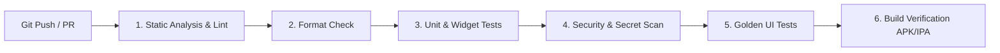

# ShadiDriver - Quality Assurance & Testing Strategy

**Document Version:** 1.0.0  
**Status:** APPROVED QUALITY SPECIFICATION  
**Author:** Lead Software Architect  
**Scope:** Client Apps (Flutter), Backend Contracts & Real-Time Telemetry  

---

## 1. Quality Strategy & Testing Pyramid

In high-stakes wedding mobility, an app crash or delayed notification can derail a once-in-a-lifetime family event. Quality assurance follows a rigorous testing pyramid prioritizing domain purity, deterministic state machines, and regression prevention.

```
                            /\
                           /  \
                          / E2E\           10% End-to-End Integration
                         /------\          (Critical Wedding Booking & Dispatch Flows)
                        / Widget \         30% Component & Golden UI Tests
                       /  & Golden\        (Design Tokens, Steppers, Cards, Forms)
                      /------------\
                     /  Unit Tests  \      60% Unit & Domain Logic Tests
                    / (Domain/State) \     (State Machine, Pricing Rules, DTO Mappers)
                   /------------------\
```

### 1.1 Test Coverage Targets
* **Domain Layer**: **> 90% Coverage**. (Pure Dart entities, value objects, state machine transitions, pricing calculation formulas, cancellation rules).
* **Data Layer**: **> 80% Coverage**. (DTO serialization/deserialization, error mapping, cache fallback).
* **Presentation Layer**: **> 70% Coverage**. (Riverpod Notifiers, UI state transitions, form validation logic).

---

## 2. Testing Layers & Tooling

### 2.1 Domain & Unit Testing
* **Tooling**: `test`, `mocktail`
* **Test Focus**:
  * **State Machine Invariants**: Verify valid and illegal transitions (e.g., confirming `REQUESTED -> TRIP_STARTED` throws an `InvalidStateTransitionException`).
  * **Dynamic Pricing Engine**: Verify base fare, overage calculation, night allowance, and muhurat surge multipliers across edge cases.
  * **Value Objects**: Verify phone number validation (`+91` standard), Aadhaar masking logic, and timestamp comparison.

```dart
// Example Unit Test: Pricing Rule Calculation
void main() {
  group('PricingCalculator', () {
    test('calculates correct fare with extra hours and muhurat surge', () {
      final calculator = PricingCalculator(
        rule: testPricingRule,
        bookedHours: 6, // Base is 4 hours, so 2 extra hours
        isMuhuratDay: true, // 1.25x multiplier
      );

      final breakdown = calculator.calculateBreakdown();
      expect(breakdown.subtotalCents, equals(1750000));
      expect(breakdown.gstCents, equals(315000));
      expect(breakdown.totalCents, equals(2065000));
    });
  });
}
```

### 2.2 Widget & Golden Testing
* **Tooling**: `flutter_test`, `golden_toolkit`
* **Test Focus**:
  * Verify UI rendering under various screen dimensions (iPhone SE, iPhone 15 Pro Max, Samsung Galaxy S23, iPad/Tablet).
  * Verify brand colors match tokens (`#58111A` Primary Burgundy, `#D4AF37` Champagne Gold).
  * Validate accessibility (screen reader labels, contrast ratio `>= 4.5:1` for body text).

### 2.3 Integration & E2E Testing
* **Tooling**: `integration_test` (Flutter official driver)
* **Core Automated Journeys**:
  1. **Customer Happy Path**: Browse Baraat Category -> Configure Attire & Addons -> Review Transparent Quote -> Submit Booking -> Verify Token Payment Mock -> Track Driver Status.
  2. **Chauffeur Onboarding & Dispatch**: Driver registers -> Uploads DL/RC -> Admin approves in mock portal -> Driver goes online -> Receives booking offer -> Accepts job -> Completes pre-trip checklist.
  3. **Emergency Standby Reassignment**: Active trip triggers breakdown alert -> Admin triggers emergency reassignment -> Customer UI smoothly switches to new chauffeur without crash or lost telemetry.

---

## 3. Mocking & Test Isolation Architecture

Tests must run fast and deterministically without external network dependencies:

* **In-Memory Fake Repositories**:
  * Test suites utilize `FakeBookingRepository` and `FakeAuthRepository` storing state in memory maps.
  * Ensures tests run in milliseconds without spin-up overhead.
* **Mocktail for Network Clients**:
  * `MockDio` used to simulate network timeouts, 500 server errors, 401 unauthorized token expirations, and malformed JSON payloads.

---

## 4. Automated CI/CD Pipeline

Every pull request must pass the continuous integration pipeline before code can be merged into `main`.



### 4.1 CI Pipeline Steps (GitHub Actions / GitLab CI)
1. **Static Analysis**:
   ```bash
   dart format --output=none --set-exit-if-changed .
   flutter analyze --fatal-infos --fatal-warnings
   ```
2. **Unit & Widget Test Suite**:
   ```bash
   flutter test --coverage --test-randomize-ordering-seed=random
   genhtml coverage/lcov.info -o coverage/html
   ```
   * *Threshold*: Fails pipeline if total line coverage falls below **80%**.
3. **Security & Dependency Audit**:
   * Run secret scanning (TruffleHog / GitGuardian) to ensure zero API keys or certificates are committed.
   * `flutter pub audit` to scan for vulnerable transitive packages.
4. **Build Smoke Tests**:
   * Compile test builds for Android (`flutter build apk --debug`) and Web (`flutter build web`).

---

## 5. High-Stakes Wedding Edge Case & Chaos Testing

Indian weddings present chaotic real-world edge cases. The test suite includes dedicated chaos simulations:

### 5.1 Mid-Ceremony Network Disconnect Simulation
* **Scenario**: Chauffeur enters an underground banquet hall with zero 4G/5G reception.
* **Verification**:
  * Driver app queues state transitions (`ARRIVED`, `TRIP_STARTED`) in local encrypted SQLite/Isar cache.
  * UI displays clear offline indicator: "Offline Mode - All milestone events are being safely recorded locally."
  * Once connectivity restores, queued events replay in exact chronological order with cryptographic checksums.

### 5.2 Concurrency Race Condition (Double-Acceptance)
* **Scenario**: Two luxury chauffeurs attempt to accept the same high-paying Baraat request simultaneously within a 20ms window.
* **Verification**:
  * Backend optimistic concurrency lock ensures exactly ONE driver's transaction succeeds (`version` increment).
  * The second driver receives a graceful `BOOKING_ALREADY_ASSIGNED` notice with alternate job suggestions, preventing double-rostered embarrassment.

### 5.3 Auspicious Muhurat Clock Drift & Midnight Crossing
* **Scenario**: Wedding ceremonies (especially Hindu *Pheras*) often span across midnight (e.g., 22:00 to 04:30).
* **Verification**:
  * DateTime calculations use UTC epoch timestamps and explicit IANA timezone offsets (`Asia/Kolkata`).
  * Night surcharge billing rules smoothly activate at the designated threshold (e.g. 23:00) without crashing the session timer.
